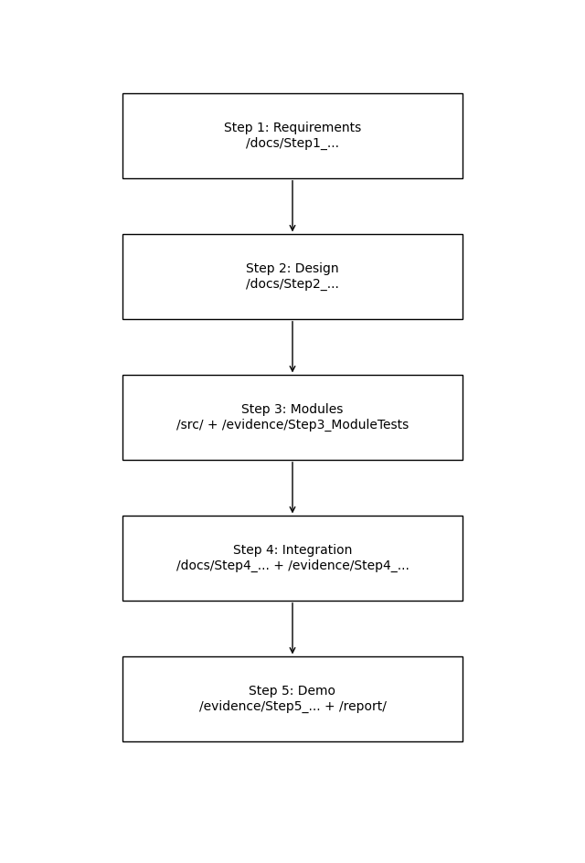

# Embedded Systems Project Starter Repository

This repository follows the official 5-Step Embedded Systems Workflow.

⚠ DO NOT modify the folder structure.

---

# 🔄 5-Step Workflow Overview

Step 1 → Requirements & Constraints  
Step 2 → System Design & Module Planning  
Step 3 → Module Implementation & Testing  
Step 4 → Feature Integration & System Verification  
Step 5 → Final Demo & Submission  

---

# 📊 Workflow → Repository Mapping Diagram

---

# 📁 Complete Folder Structure

Project-Name/

├── README.md  
├── .gitignore  

├── keil/  
│   └── README.md  

├── docs/  
│   ├── Step1_Requirements.md  
│   ├── Step2_System_Design.md  
│   ├── Step3_Module_Test_Report.md  
│   ├── Step4_System_Integration_Report.md  
│   └── AI_Log.md  

├── src/  
│   ├── main.c  
│   ├── ModuleTest.c  
│   ├── modules/  
│   │   ├── module_example.c  
│   │   └── module_example.h  
│   └── drivers/  
│       ├── driver_example.c  
│       └── driver_example.h  

├── evidence/  
│   ├── Step3_ModuleTests/  
│   │   └── README.md  
│   ├── Step4_Robustness/  
│   │   └── README.md  
│   └── Step5_Final_Demo/  
│       └── README.md  

└── report/  
    └── Final_Project_Report.pdf  

---

# 🔧 Important Rules

• Write your own code in Steps 3 and 4  
• AI allowed only for debugging and verification  
• Keep modules and drivers separated  
• Keep evidence organized by step  
• Do NOT rename or delete folders  

---

This structure mirrors professional embedded firmware repositories and supports clean modular development, integration, and validation.
