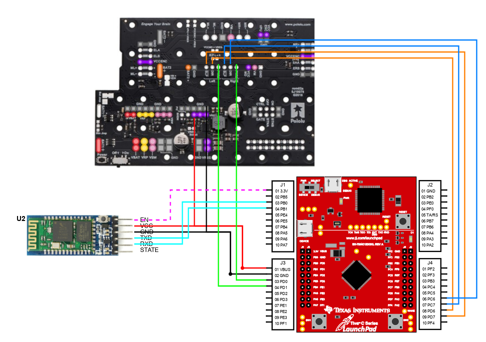

# Step 1 – Requirements & System Design

## 1. Functional Requirements

- RQ-01: Two part system
- RQ-02: Bluetooth Setup Module
- RQ-03: Bluetooth Car Module Mode 1: Demo  
- RQ-04: Bluetooth Car Module Mode 2: Free Drive   

### Bluetooth Setup Module   
- RQ-05: UART1 used to communicate with HC-05 Bluetooth module   
- RQ-06: UART0 used to communicate with PC terminal and MCU  
- RQ-07: Set HC-05 to Command Mode  
- RQ-08: On start up displays the Initial Set up message in PC terminal:
    > Welcome to Serial Terminal!   
    > This is the setup program for the HC-05 Bluetooth module.  
    > You are at 'AT' Command Mode.   
    > Type 'AT' and followed with a command.      
    > Example AT+NAME = Your Name   
- RQ-09: After boot up, loop and wait for user to enter a command in terminal  
- RQ-10: Sends entered user command to set up HC-05 
- RQ-11: Returns the HC-05 response to the PC terminal and display on PC 
terminal:
    > User input command  
    > response to user inputted command  
- RQ-12: Set up HC-05 Name
- RQ-13: Set up HC-05 Pass
- RQ-14: Set up HC-05 UART
- RQ-15: Set up HC-05 Role
    
### Bluetooth Car  

- RQ-16: HC-05 will be set up in Data Mode  
- RQ-17: UART1 used to communicate with HC-05 Bluetooth module   
- RQ-18: Communicate to Car with a smartphone/PC via Bluetooth
- RQ-19: Initally boots in Mode 1  
- RQ-20: SW1 to toggle between modes 1 and 2  
- RQ-21: Use Hardware PWM0 to drive motors on Romi Chassis  

#### Mode 1 Demo  
- RQ-22: Upon entering LED = Green  
- RQ-23: Send command from Bluetooth Terminal to MCU to drive car in designated routes:  
    - RQ-24: '8': Draws one figure 8 and stops
    - RQ-25: 'C': Draw one circle and stops
    - RQ-26: 'S': Draw one square and stops
    - RQ-27: 'Z': Draw a zigzag with 4 segments and stop

#### Mode 2 Free Drive
- RQ-28: Upon entering LED = Blue  
- RQ-29: Send a command from Bluetooth Terminal to MCU to drive car:
    - RQ-30: 'F': Moves car forward
    - RQ-31: 'B': Moves car backward
    - RQ-32: 'L': Moves car in left wide turn
    - RQ-33: 'R': Moves car in right wide turn
    - RQ-34: 'S': Stops car 
    - RQ-35: 'U': Speeds car up
    - RQ-36: 'D': Slows car down

---

## 2. Constraints

- CN-01: Default Baud Rate for Command Mode: 38400
- CN-02: Default Baud Rate for Data Communication Mode: 9600
- CN-03: UART1 must be used to communicate with HC-05
- CN-04: In setup module, HC-05 must be in Command mode
- CN-05: In setup module, PC Terminal must be used to send AT coommands to HC-05
- CN-06: In setup module, UART0 must be used to communicate with MCU to PC
- CN-07: In setup module, invalid commands receive error response 
- CN-08: In setup module, Dont set HC-05 name to CECS447
- CN-09: In setup module, Dont set HC-05 pass to 1234
- CN-10: In car module, HC-05 must be in Data mode
- CN-11: In car module, Must use Hardware PWM
- CN-12: In car module, Communicate to Car with a smartphone/PC via Bluetooth
- CN-13: In car module, invalid inputs are not accepted

---

## 3. System Design

### 3.1 Hardware Plan
- GPIO assignments
    - PWM: PD01
    - Right DIR/SLP: PC67
    - Left DIR/SLP: PD67
    - Bluetooth RX/TX: PB01
    - LEDS: PF123
- Peripherals used
    - Bluetooth Module
- External components  
    - Romi Chassis

#### Schematic

### 3.2 Software Architecture
- High-level module list  
    - PWM_driver.c
    - UART1_driver.c
    - UART0_driver.c
    - LED_driver.c
    - PWM_app.c
    - UART1_app.c
    - UART0_app.c
    - LED_app.c
    - mode1.c
    - mode2.c
    - setup.c
    - main.c
- Responsibilities of each module  
    - Motor_driver.c:
        - Initialize PWM0-67 on PD01, initalize PC67 and PD67 for SLP/DIR
    - UART1_driver.c
        - Initializes UART1 on PB01 with interrupt, sets UART1 baud rate. Controls UART1 interrupt
    - UART0_driver.c
        - Initializes UART0 with interrupt, sets UART0 baud rate. Controls UART0 interrupt
    - Switch_driver.c
        - Initializes SW1 on PF4 with interrupt. Handles SW1 interrupts
    - LED_driver.c
        - Initializes LEDs on PF123
    - Motor_app.c
        - Uses functions to manage motors. Changes duty cycle to control speed, changes SLP/DIR to control direction and turns.
    - UART1_app.c
        - Controls UART1 receive and transmit functions. Handles UART1 processed data.
    - UART0_app.c
        - Controls UART1 receive and transmit functions. Handles UART1 processed data.
    - Switch_app.c
        - Manages SW1_Pressed input from interrupt
    - LED_app.c
        - Controls LED on and off functionality
    - mode1.c
        - Manages Mode 1 functions such as car movement and turns, s well as interpret
    - mode2.c
        - Manages Mode 2 functions such as car movement and turns, as well as interpreting UART1 processed data
    - setup.c
        - Manages Bluetooth Module set up. Sets Bluetooth name, baud rate, status
    - main.c
        - Manages entering and exiting modes.
---

## 4. Design Justification

Explain:
- Why this design was chosen  
    - This design was chosen due to the requirements limiting us to certain ports. This includes the requirement of UART1 limiting us to PB01 for RX/TX, LEDS limiting us to PF123, and SW1 limiting us to PF0. However, we are free to choose any pins for PWM and the DIR/SLP pins for the romi chassis, to which we chose PWM0-67 on PD01 and PC67 for Left DIR/SLP and PD67 for Right DIR/SLP. Ultimately, we chose these ports because we liked the numbers. Other than that, we chose PMW0 due to its availability on Debug Mode, allowing us to see the duty cycle operate properly via logic analyzer. This simplifies our testing for PWM, as it allows us to see the duty cycle via logic analyzer.
- Tradeoffs considered (optional alternatives)
    - Originally, we chose to use PWM1-01 on PD01. However, as we realized, PWM1 is not compatible with Debug Mode's logic analyzer, which prevents us from using it for testing. We realized that PWM0, which is compatible, is located on PD01 as well. So, without switching the ports, we merely switched the PWM we are using for ease of testing. We also originally planned to use PE67 for DIR/SLP. However, we failed to realize that Port E is the only port with 6 connections. After being unable to find PE67 on our boards, we switched to using PC67 instead.

---

## 5. AI Verification Summary

- What AI was used for  
    - n/a
- What was verified  
    - n/a
- What was accepted/rejected  
    - n/a
